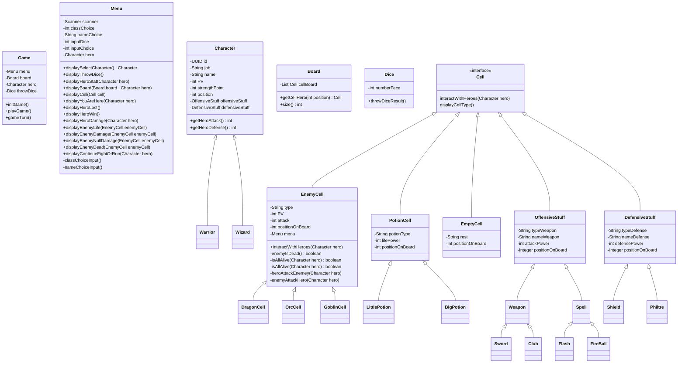

```mermaid
classDiagram
    
    Game: -Menu menu
    Game: -Board board
    Game: -Character hero
    Game: -Dice throwDice
    Game: +initGame()
    Game: +playGame()
    Game: +gameTurn()
    
    Menu: -Scanner scanner
    Menu: -int classChoice
    Menu: -String nameChoice
    Menu: -int inputDice
    Menu: -int inputChoice
    Menu: -Character hero
    Menu: +displaySelectCharacter() Character
    Menu: +displayThrowDice()
    Menu: +displayHeroStat(Character hero)
    Menu: +displayBoard(Board board , Character hero)
    Menu: +displayCell(Cell cell)
    Menu: +displayYouAreHere(Character hero)
    Menu: +displayHeroLost()
    Menu: +displayHeroWin()
    Menu: +displayHeroDamage(Character hero)
    Menu: +displayEnemyLife(EnemyCell enemyCell)
    Menu: +displayEnemyDamage(EnemyCell enemyCell)
    Menu: +displayEnemyNullDamage(EnemyCell enemyCell)
    Menu: +displayEnemyDead(EnemyCell enemyCell)
    Menu: +displayContinueFightOrRun(Character hero)
    Menu: -classChoiceInput()
    Menu: -nameChoiceInput()
    
    Character <|-- Warrior
    Character <|-- Wizard
    Character: -UUID id
    Character: -String job
    Character: -String name
    Character: -int PV
    Character: -int strengthPoint
    Character: -int position
    Character: -OffensiveStuff offensiveStuff
    Character: -DefensiveStuff defensiveStuff
    Character: +getHeroAttack() int
    Character: +getHeroDefense() int
    
    Board: -List Cell cellBoard
    Board: +getCellHero(int position) Cell
    Board: +size() int

    Dice: -int numberFace
    Dice: +throwDiceResult()

    class Cell
    <<interface>> Cell
    Cell <|-- EnemyCell
    Cell <|-- PotionCell
    Cell <|-- EmptyCell
    Cell <|-- OffensiveStuff
    Cell <|-- DefensiveStuff
    Cell: interactWithHeroes(Character hero)
    Cell: displayCellType()
    class EmptyCell {
        -String rest
        -int positionOnBoard
    }

    EnemyCell <|-- DragonCell
    EnemyCell <|-- OrcCell
    EnemyCell <|-- GoblinCell
    EnemyCell: -String type
    EnemyCell: -int PV
    EnemyCell: -int attack
    EnemyCell: -int positionOnBoard
    EnemyCell: -Menu menu
    EnemyCell: +interactWithHeroes(Character hero)
    EnemyCell: -enemyIsDead() boolean
    EnemyCell: -isAllAlive(Character hero) boolean
    EnemyCell: -isAllAlive(Character hero) boolean
    EnemyCell: -heroAttackEnemey(Character hero)
    EnemyCell: -enemyAttackHero(Character hero)
    
    PotionCell <| -- LittlePotion
    PotionCell <| -- BigPotion
    PotionCell: -String potionType
    PotionCell: -int lifePower
    PotionCell: -int positionOnBoard
    
    OffensiveStuff <| -- Weapon
    OffensiveStuff <| -- Spell
    OffensiveStuff: -String typeWeapon
    OffensiveStuff: -String nameWeapon
    OffensiveStuff: -int attackPower
    OffensiveStuff: -Integer positionOnBoard
    
    Weapon <| -- Sword
    Weapon <| -- Club
    
    Spell <| -- Flash
    Spell <| -- FireBall
    
    DefensiveStuff <| -- Shield
    DefensiveStuff <| -- Philtre
    DefensiveStuff: -String typeDefense
    DefensiveStuff: -String nameDefense
    DefensiveStuff: -int defensePower
    DefensiveStuff: -Integer positionOnBoard
    
```

